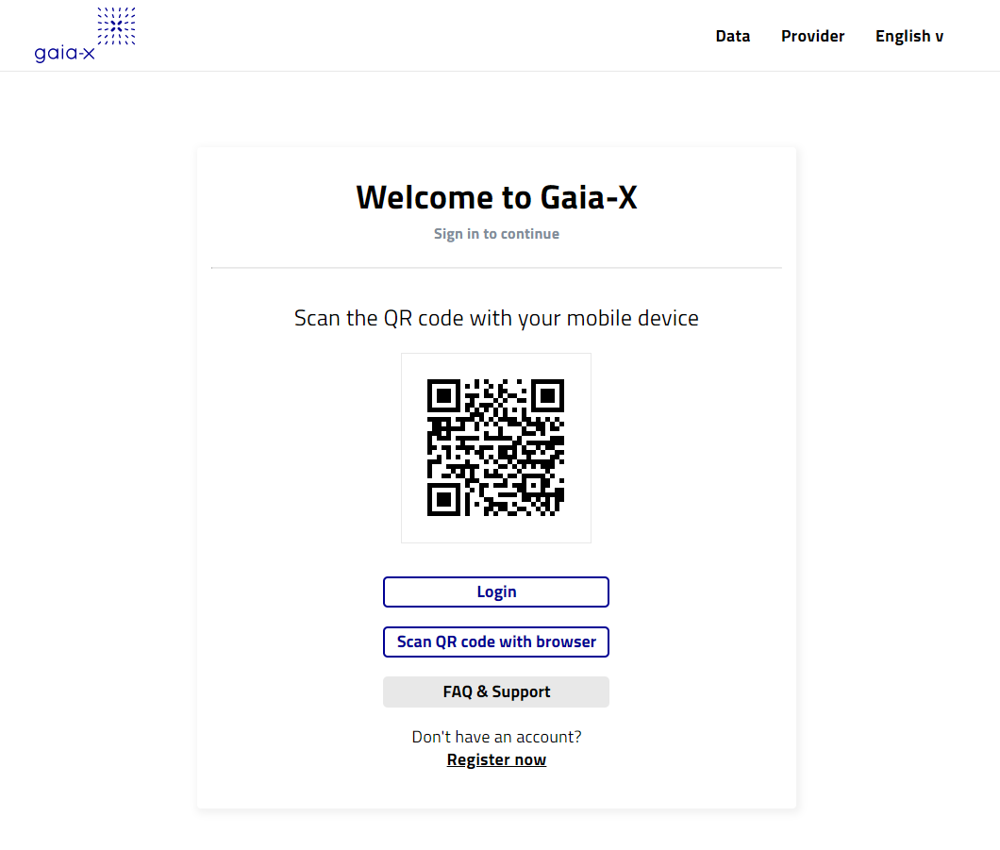

# Authentication & Authorization Service

## Description
This is a Reference Implementation of GAIA-X LOT1 [Authentication & Authorization Service](https://www.gxfs.eu/authentication-authorisation/).

## Documentation
All service documentation, installation instructions and other materials can be found in the [AAS documentation section](./doc).

## Support
To get support you can open an issue in the project [Issues](https://gitlab.com/gaia-x/data-infrastructure-federation-services/authenticationauthorization/-/issues) section.

## Getting Started
To start with AAS project download it to your local machine, go to project's root folder and build it with maven: 

    >mvn clean install

After all artifacts are ready you can run local image with docker compose: 

    >cd docker
    >docker-compose up

The running image contains a pre-configured Keycloak instance and an instance of AA service. It also contains an instance of Demo application protected by AAS and IAM (keycloak). To test how the image works try to open in your browser protected resource from Demo app: `http://test-server:8990/demo`. If you're not authenticated yet you'll be redirected to the Keycloak login page:

 

Click on the SSI OIDC Broker button - then you will be redirected to AAS login page:

  

After scanning QR code please press the Login button - then AAS will authenticate you and you'll get access to the Demo application.

## Roadmap
The project is in the development phase how. We're going to implement all required functionality till the end of April 2022 and then test and stabilize it during May and  June 2022.

## Contributing
If you want to contribute to the project - please request a membership at [Project Members](https://gitlab.com/gaia-x/data-infrastructure-federation-services/authenticationauthorization/-/project_members) section or drop an email to project maintainer [Denis Sukhoroslov](mailto:denis.sukhoroslov@t-systems.com)

## Authors and acknowledgment
The project is implemented by T-Systems International GmbH, direct project members are:
- [Viktor Nemeš](https://gitlab.com/nemesviktor)
- [Simon Javorsky](https://gitlab.com/sJavorskyEts)
- [Giancarlo Errigo](https://gitlab.com/gerrigom)
- [Ihor Muzychka](https://gitlab.com/borealis132)
- [Ladislav Jurcisin](https://gitlab.com/ladislav.jurcisin)
- [Denis Sukhoroslov](https://gitlab.com/dsukhoroslov)

The project implementation wouldn't be possible without a great help of our partners from Fraunhofer Institute:
- Wolfgang Studier
- Thomas Bellebaum
- Martin Schanzenbach

## License
GAIA-X Authentication & Authorization Server is Open Source software released under the [Apache 2.0 license](https://www.apache.org/licenses/LICENSE-2.0.html).

