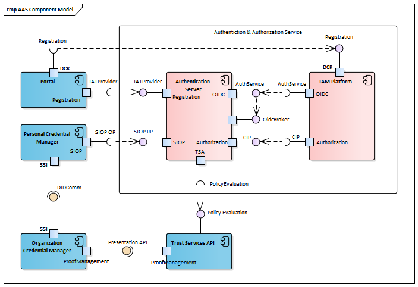

## AAS Architecture Overview

Major AAS components and other GAIA-X services involved in communication with AAS are presented on the diagram below:

The components are:
- Auth Service: major [Authentication & Authorization Service](https://www.gxfs.eu/authentication-authorisation/) component exposing endpoints required by GAIA-X LOT1 specification.
- IAM Platform: Identity and Access Management platform like keycloak, Gluu, WSO2, etc. 
- [Portal](https://www.gxfs.eu/portal/): web application protected with AAS, implemented as GAIA-X LOT13.
- [Personal Credential Manager](https://www.gxfs.eu/personal-credential-manager/): mobile application (SSI Wallet), GAIA-X LOT2 implementation.
- [Organization Credential Manager](https://www.gxfs.eu/organizational-credential-manager/): GAIA-X LOT3 implementation.
- [Trust Service API](https://www.gxfs.eu/trust-services-api/): GAIA-X LOT4 implementation.

The Auth Server component is implemented as a regular Spring Boot Java application. Required OpenID/OAuth2 functionality is provided by [Spring Authorization Server](https://docs.spring.io/spring-authorization-server/docs/current/reference/html/index.html) with help of [Spring Security](https://spring.io/projects/spring-security-oauth) components. 

The standard protocols used in component communications are:
- [OIDC Discovery](https://openid.net/specs/openid-connect-discovery-1_0.html)
- [OIDC Authorization Code Flow](https://openid.net/specs/openid-connect-core-1_0.html)
- [OIDC Dynamic Client Registration](https://openid.net/specs/openid-connect-registration-1_0.html)
- [Self-Issued OpenID Provider](https://openid.net/specs/openid-connect-self-issued-v2-1_0.html)
- [DIDComm Messaging](https://identity.foundation/didcomm-messaging/spec/)

And GAIA-X related API/protocols are:
- Presentation API - endpoints used between [OCM](https://www.gxfs.eu/organizational-credential-manager/) and [TSA](https://www.gxfs.eu/trust-services-api/) in Proof Management scenarios
- [Policy Evaluation API](../functions/tsa) - [TSA](https://www.gxfs.eu/trust-services-api/) Policy Evaluation endpoint
- [IAT Provider API](../functions/iat_provider) - endpoints providing Initial Access Token Issuing functionality
- [Claim Information API](../functions/cip_endpoint) - an endpoint for dynamic claims-based policy resolution, a kind of standard PIP functionality

There are technical interfaces also:
- OidcBroker - internal endpoints implementing custom [Spring Security](https://spring.io/projects/spring-security-oauth) Login Page
- Actuator - a number of endpoints provided by [Spring Boot Actuator](https://docs.spring.io/spring-boot/docs/current/actuator-api/htmlsingle/) component 

AAS customizes behavior of OIDC AuthService (/openid-configuration, /authorize, /jwks, /token, /userinfo endpoints) and also implements several other interfaces, more details about their functionality and implementation can be found in the [AAS Functions](../functions) section.