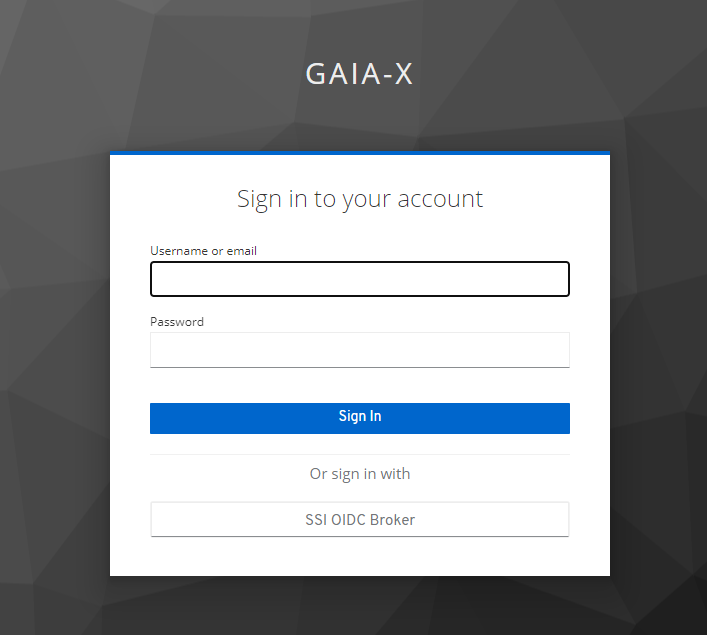

## Build Procedures

### Perpetration
First clone the AAS repository:

```
>git clone https://gitlab.com/gaia-x/data-infrastructure-federation-services/authenticationauthorization.git
```

To test locally how AAS, IAM and Demo application protected with IAM work together set their domains in /hosts file
```
127.0.0.1	auth-server
127.0.0.1	key-server
127.0.0.1	test-server
```


### Docker Only
To run the A&A Service and IAM (Keycloak) and start and build them with run  docker-compose in the `docker` folder:
```
>cd docker
>docker-compose up --build
```
### MVN and Docker

Ensure you have JDK 17 (or newer) and Maven 3.5.4 (or newer) installed.

Then go to the project folder and build it with maven:

```
>mvn clean install
```

This will build all modules and run the testsuite.

To run the A&A Service and IAM (Keycloak) go to /docker folder and start them with docker-compose:

```
>cd docker
>docker-compose --env-file dev.env up 
```

### Initial Setup
On the first start we must set expected secret values for predefined SSI Identity Providers. To do this please open keycloak admin console at `http://key-server:8080/admin`, select `Gaia-X` realm, go to Identity Providers section and set proper Client Secret values:
- SSI OIDC Broker secret is `secret`
- SSI SIOP Broker secret is `secret2`

Then you can test how OIDC Authentication Flow works accessing `http://test-server:8990/demo` endpoint. You should be redirected to Keycloak Login page:



Choose OIDC Broker option - then you'll be redirected to GAIA-X custom Login page. After some time you'll be automatically authenticated and redirected back to the protected Demo application.
