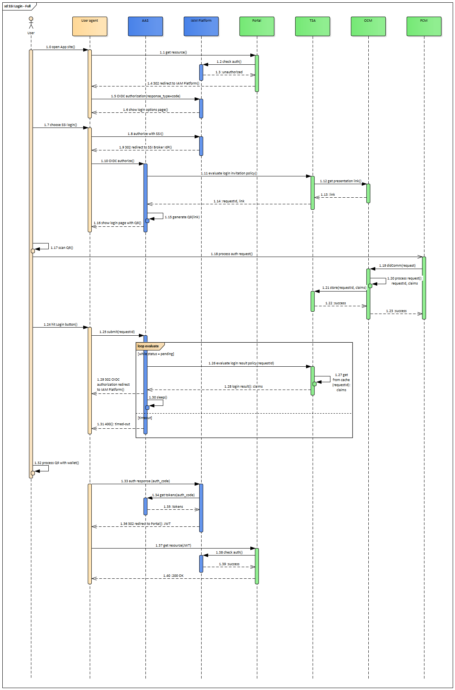

## SSI Login - Big Picture

This is to see the full picture and discuss required integration points between GAIA-X services. Participants are:

- User agent: browser. 
- AAS: [Authentication & Authorization Service](https://www.gxfs.eu/authentication-authorisation/), GAIA-X LOT1 implementation.
- IAM Platform: Identity and Access Management solution like keycloak, Gluu, WSO2, etc. 
- Portal: [Portal](https://www.gxfs.eu/portal/) web application, GAIA-X LOT13 implementation.
- TSA: [Trust Service API](https://www.gxfs.eu/trust-services-api/), GAIA-X LOT4 implementation.
- OCM: [Organization Credential Manager](https://www.gxfs.eu/organizational-credential-manager/), GAIA-X LOT3 implementation. 
- PCM: [Personal Credential Manager](https://www.gxfs.eu/personal-credential-manager/), GAIA-X LOT2 implementation. 

