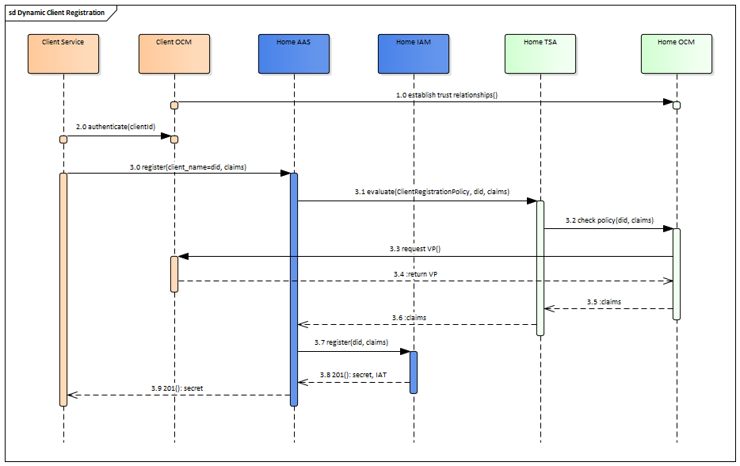

## Dynamic Client Registration

As alternative, the DCR scenario can be covered completely by our AAS implementation removing a necessity for Client to do extra calls for IAT and performing the whole scenario in synchronous way. Communication participants are:

- Client Service – an application or service in Client domain
- Client OCM – [Organization Credential Manager](https://www.gxfs.eu/organizational-credential-manager/) in Client domain
- Home AAS – [Authentication & Authorization Service](https://www.gxfs.eu/authentication-authorisation/) in Home domain
- Home TSA – [Trust Service API](https://www.gxfs.eu/trust-services-api/) in Home domain
- Home OCM – [Organization Credential Manager](https://www.gxfs.eu/organizational-credential-manager/) in Home domain
- Home IAM – Identity and Access Management Platform in Home domain

An alternative DCR communication flow is:

1.	OCM services from different domains establish trust connection between each other (some flow in Notarization or Orchestration LOTs, probably)
2.	Client Service registers with OCM in its local (Home) domain
3.	Client Service performs a dynamic registration via standard DCR endpoint in Home AAS
