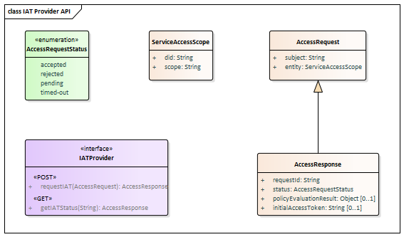
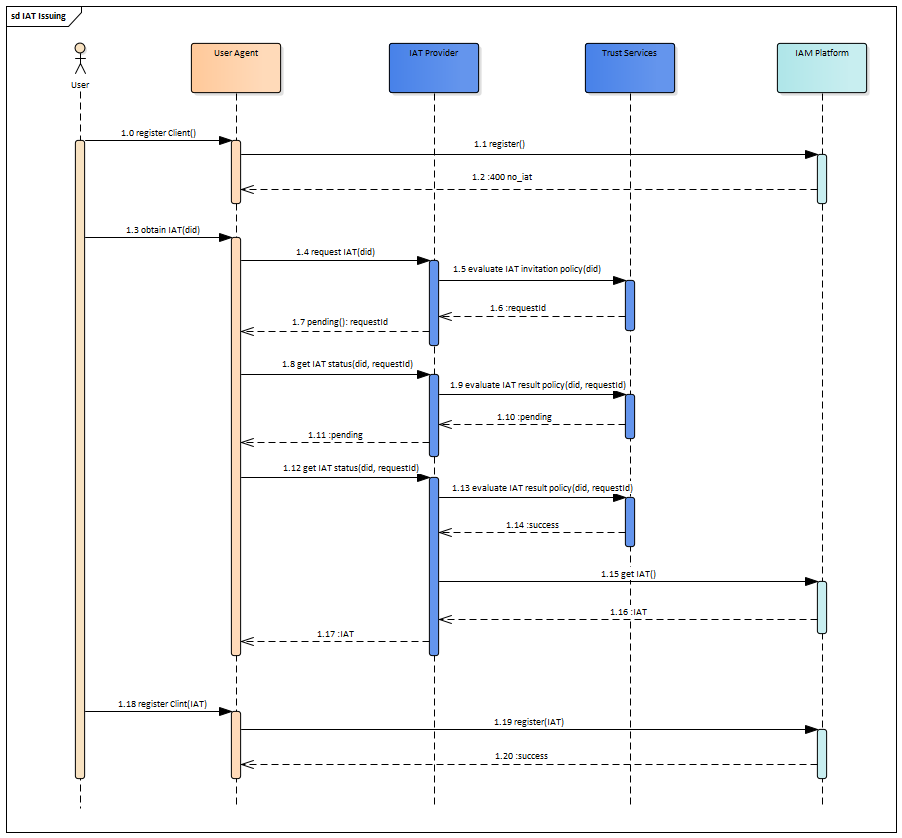
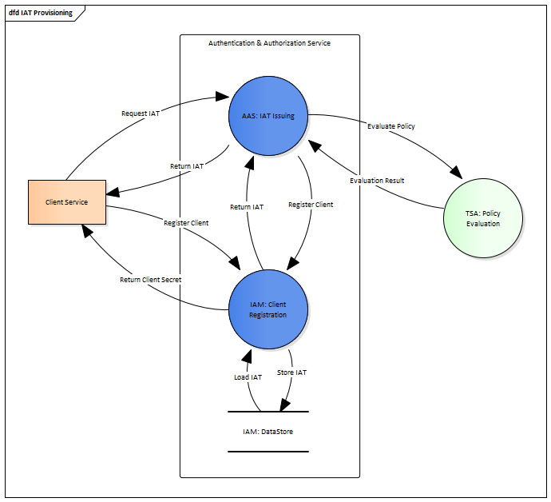

## Initial Access Token Issuing

The scenario happens between two GAIA-X domains (Client domain, SSI domain), when some application or service from Client domain wants to be registered in SSI domain and in it internal IAM Platform. To be protected with AAS and IAM, client applications must be registered in the IAM. Client can be registered in IAM using Dynamic Client Registration (DCR) protocol, but at the call to DCR endpoint Client must be authenticated. Client can be authenticated to IAM with help of Initial Access Token (IAT) provided as Bearer value in Authorization header. So, the IAT Issuing interface provides an ability for external Clients to obtain IAT to be used for authentication in subsequent DCR scenario.

The IAT Provider API is:

The communication flow between Client app, AAS and its IAM is:

And the Data Flow Diagram for this functionality is:

An alternative scenario proposed in [Dynamic Client Registration](../dcr) function.

