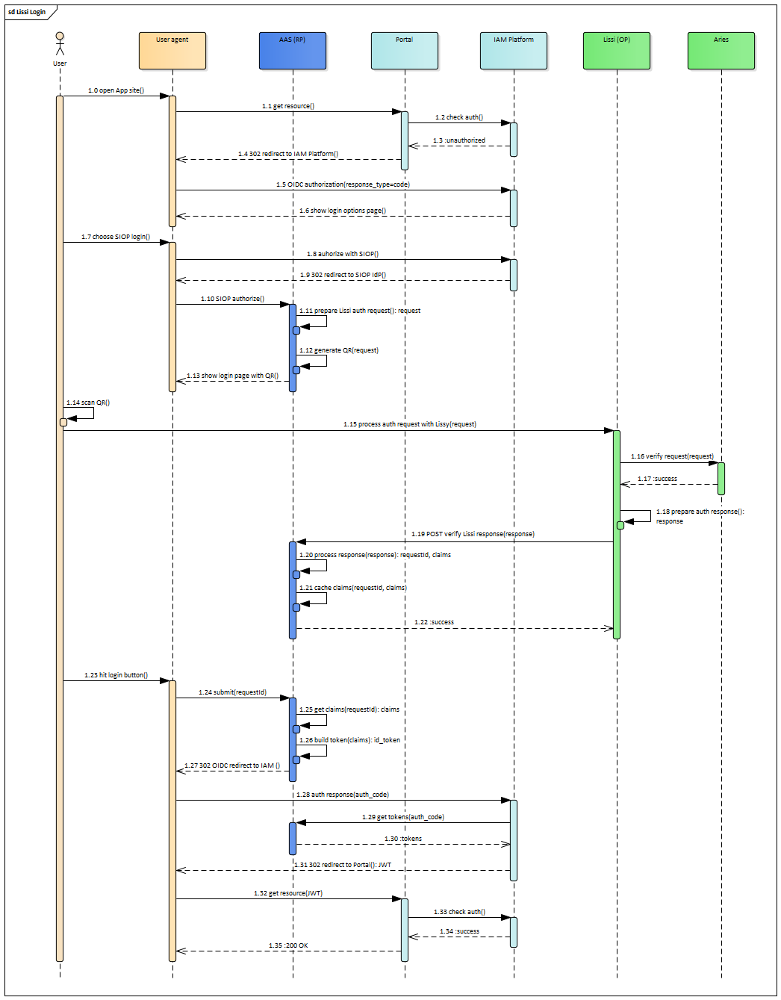

## Possible integration with Lissi Wallet

It is very similar to SIOP protocol and bypass communication with underlying SSI infrastructure on AAS side. Participants are:

- User agent: browser. 
- AAS (RP): [Authentication & Authorization Service](https://www.gxfs.eu/authentication-authorisation/), GAIA-X LOT1 implementation.
- Portal: [Portal](https://www.gxfs.eu/portal/) web application, GAIA-X LOT13 implementation.
- IAM Platform: Identity and Access Management solution like keycloak, Gluu, WSO2, etc. 
- Lissi (OP): Lissi Wallet - mobile application processing user credentials. 
- Aries: Blockchain holding user Verifiable Credentials.

The only difference with SIOP in how auth request is prepared in AAS (step 1.11) and what is provided to AAS auth callback from Lissi (step 1.19).