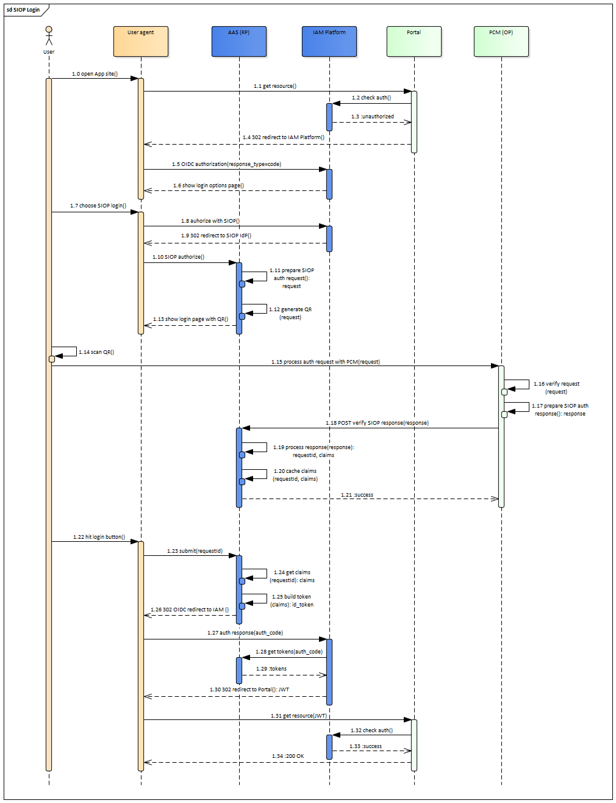

## SSI SIOP login

The SSI SIOP login flow. Participants are:

- User agent: browser. 
- AAS (RP): [Authentication & Authorization Service](https://www.gxfs.eu/authentication-authorisation/), GAIA-X LOT1 implementation. Works as RP part in SIOP protocol.
- Portal: [Portal](https://www.gxfs.eu/portal/) web application, GAIA-X LOT13 implementation.
- IAM Platform: Identity and Access Management solution like keycloak, Gluu, WSO2, etc. 
- PCM (OP): [Personal Credential Manager](https://www.gxfs.eu/personal-credential-manager/), GAIA-X LOT2 implementation. Works as OP part in SIOP protocol. 

