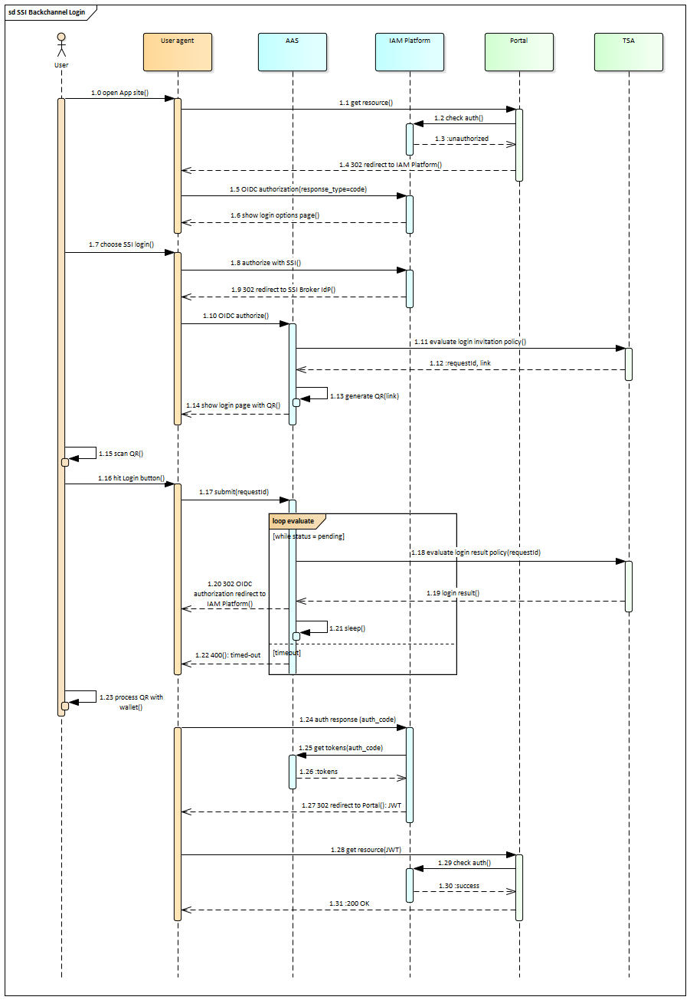
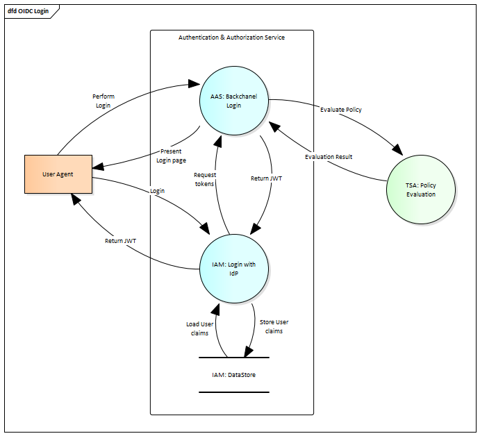

## SSI OIDC login

The SSI OIDC login flow. Participants are:

- User agent: browser. 
- AAS: [Authentication & Authorization Service](https://www.gxfs.eu/authentication-authorisation/), GAIA-X LOT1 implementation.
- TSA: [Trust Service API](https://www.gxfs.eu/trust-services-api/), GAIA-X LOT4 implementation.
- Portal: [Portal](https://www.gxfs.eu/portal/) web application, GAIA-X LOT13 implementation.
- IAM Platform: Identity and Access Management solution like keycloak, Gluu, WSO2, etc. 

Additional information:

- 1.11: The AAS makes a `POST` request to the TSA, for the `GetLoginProofInvitation` policy. For example, it could be to this endpoint, depending on the AAS configuration: `/policy/example/GetLoginProofInvitation/1.0/evaluation`. No parameters are set.
- 1.12: The TSA responds with a JSON object with keys `link`, `requestId` and `status`, the status is `pending` at this point.
- 1.18: The AAS makes a `POST` request to the TSA, for the `GetLoginProofResult` policy. For example, it could be to this endpoint, depending on the AAS configuration: `/policy/example/GetLoginProofResult/1.0/evaluation`. The AAS sends a `requestId` in the post body of the request.
- 1.19: If the login is still pending, the TSA returns a JSON object with `status: pending` and the HTTP response code is 204. If a user has logged in, the return code is 200 and the user claims are sent, together with `status: accepted`.

Data Flow Diagram for SSI OIDC login is:

