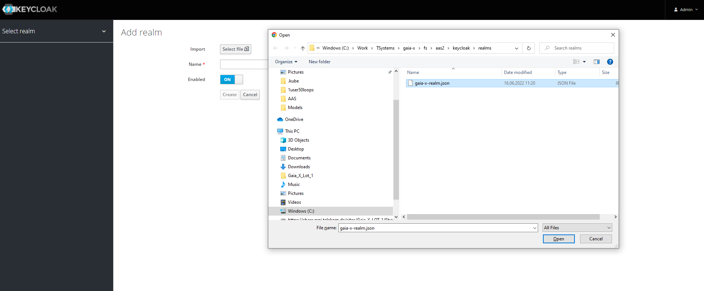
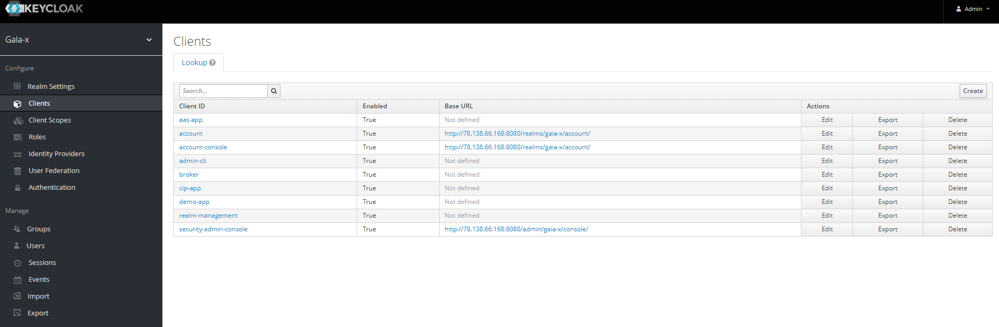
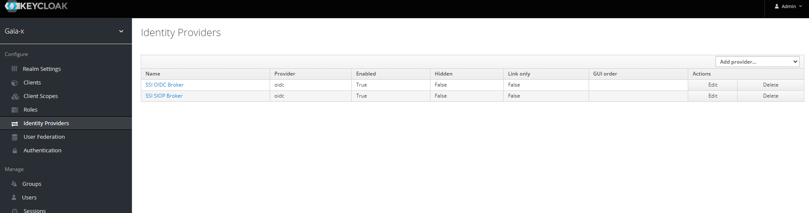
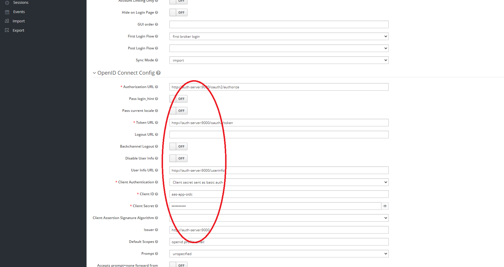

## Keycloak Setup

Keycloaak deployment scripts for Kubernetes are in `/keycloak/deploy` folder. Install them in the following order:

```
>kubectl apply -f service.yaml
>kubectl apply -f secret-pass.yaml
>kubectl apply -f serviceaccount.yaml
>kubectl apply -f deployment.yaml
>kubectl apply -f ingress.yaml
```
KeycloaK administration console must be accessible in browser at `https://key-server.gxfs.dev/admin`

- move mouse pointer to the top-left corner under the Master realm and hit the appeared Add realm button:
- 

<br>

- in the Add realm window you can Import all required real settings. Use Select file button and provide `gaia-x-realm.json` file from `/keycloak/realm` folder:
- 
- hit Create button and get `gaia-x` realm created

<br>

- now go to the Client Registration tab in the realm settings and press Create button in the top-right corner:
- 
- set Count to 1000000 and hit Save button, then copy and store the generated Initial Access Token (IAT)
- the generated IAT will be used later in the IAT Provider scenarios. The IAT value must be set at [AAS Installation](../aas) step in `secret-keys.yaml` `stringData.iat` value.

<br>

- with imported realm settings you should get three new Clients created: `aas-app`, `cip-app`, `demo-app`
- 

<br>

- and two new Identity Providers: `SSI OIDC Broker`, `SSI SIOP Broker`
- 

<br>

- open `SSI OIDC Broker` and set proper IP address or DNS name for `auth-server` in IdP settings:
- 
- also ensure the Client Secret value is in synch with `secret-oidc.yaml` `password` value from [AAS Installation](../aas)
- Save your changes, then do the same for `SSI SIOP Broker`
- now Keycloak is ready to protect demo applications with external SSI brokers

