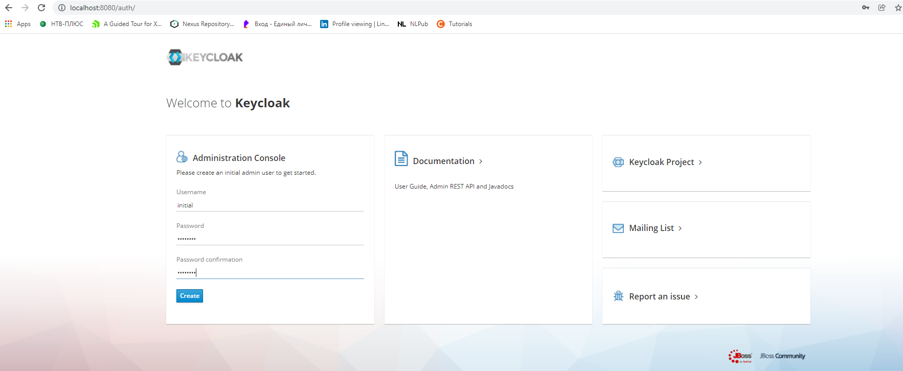
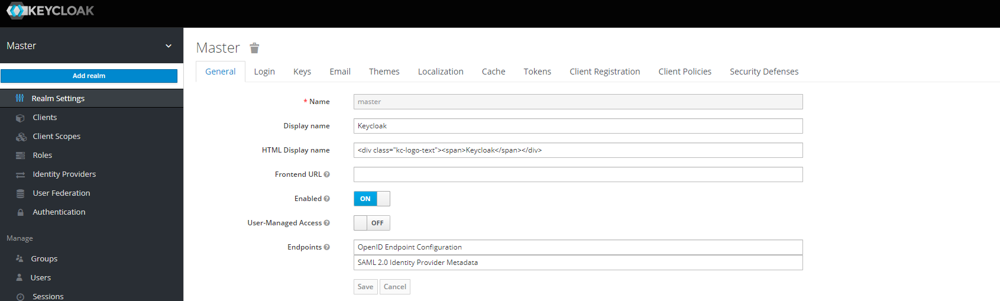
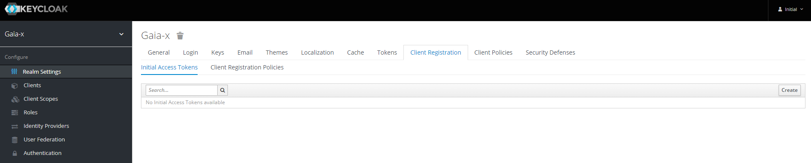

## Initial keycloak setup

Keycloak (https://www.keycloak.org/) was chosen as an IAM Platform for our service deployment. Our service and test application to be protected must be registered with IAM solution properly. To setup keycloak platform the following steps must be accomplished:

- download keycloak image from the Keycloak site
- unzip downloaded archive to ${KC_HOME}
- start keycloak application using ${KC_HOME}/bin/standalone script
- open keycloak Admin console in your browser at http://localhost:8080/auth
- at first login create new user with login and password
- 
- on the next screen hit the Administration Console link and login to it with just created credentials
- move mouse pointer to the top-left corner under the Master realm and hit the appeared Add realm button:
- 
- set gaia-x name for the new realm and hit Create button
- 
- now go to the Client Registration tab in the realm settings and press Create button in the top-right corner:
- 
- set Count to 1000000 and hit Save button, then copy and store the generated IAT
- the generated IAT will be used later in the IAT Provider scenarios
